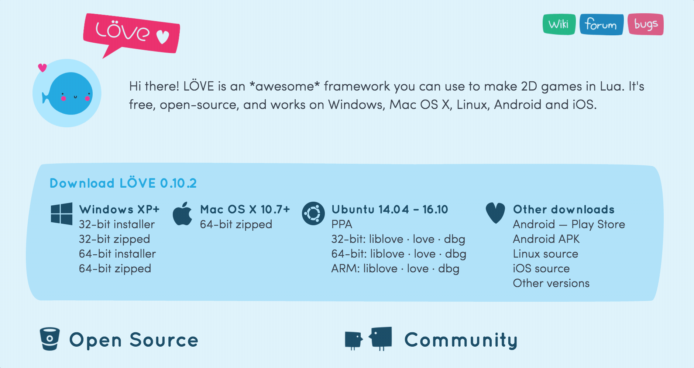

## Beginner friendly LÖVE 2D documentation
Welcome to the beginner friendly love2d documentation. Here you'll find a group of examples and neat implementation of this beautiful game framework. Follow me in this exciting journey to becoming a game developer, put on your seatbelt and enojoy the ride. (Seriusly, please put on that seatbelt the road is a little rough).

### What is LÖVE?
LÖVE is an *awesome* framework you can use to make 2D games in Lua. It's free, open-source, and works on Windows, Mac OS X, Linux, Android and iOS. Source: [love2d.org](https://love2d.org/)

> If you really want to know more details about this *wonderful framework* adn what is Lua for example go to "[Is LÖVE good for me?](site/is-love-good-for-me/#is-love-good-for-me)"

### Getting started
Let us begin with the basic requirements.

1. The **[love2d application](https://love2d.org/#download)**.
2. Any **text editor** of choice. However, my recomendations are:
    - [Sublime Text](http://www.sublimetext.com/) (Freemium. macOS/Windows/Linux Support).
    - [Atom](https://atom.io/) (Free. Open Source. macOS/Windows/Linux Support)
    - [Visual Studio Code](https://code.visualstudio.com/) (Free. Open Source. macOS/Windows/Linux Support)
    - [ZeroBraneStudio](https://studio.zerobrane.com/) (Not really a text editor it's an IDE. Free. Portable. Open Source. macOS/Windows/Linux Support).

    I'll be using **Visual Studio Code** in this guide because it would be visually easier to setup, but no matter which text editor you choose the code should run the same on any platform. Choosing a text editor is like choosing the flavour of an ice cream, at the end of the day it's a matter of preference. I'll recommend you try all of these and then choose the one that you *feel more confortable* using, you'll be working with it on many projects from now on.

3. **Stay Organized**: This is not really a requirement but more like a recommendation, allocate a folder on your Documents or Desktop to create an accesible place to work with your files. A folder named `/love2d-projects` should work just fine.

---
#### Installing LÖVE
Download **love2d** to your desktop from [the download site](https://love2d.org/#download).

Choose the appropiate link for your current desired operating system. In my case it would be macOS, but don't worry there are no perticular differences between the two other than the way of opening the files. I'll go through the process of using both Windows and macOs versions on this quick [installation process](#installation-process).


*At the moment of this writting the current stable version of LÖVE is 0.10.2.*

#### Installation Process

```lua
    function love.draw()
        love.graphics.rectangle(10, 10, 100, 100)
    end
```