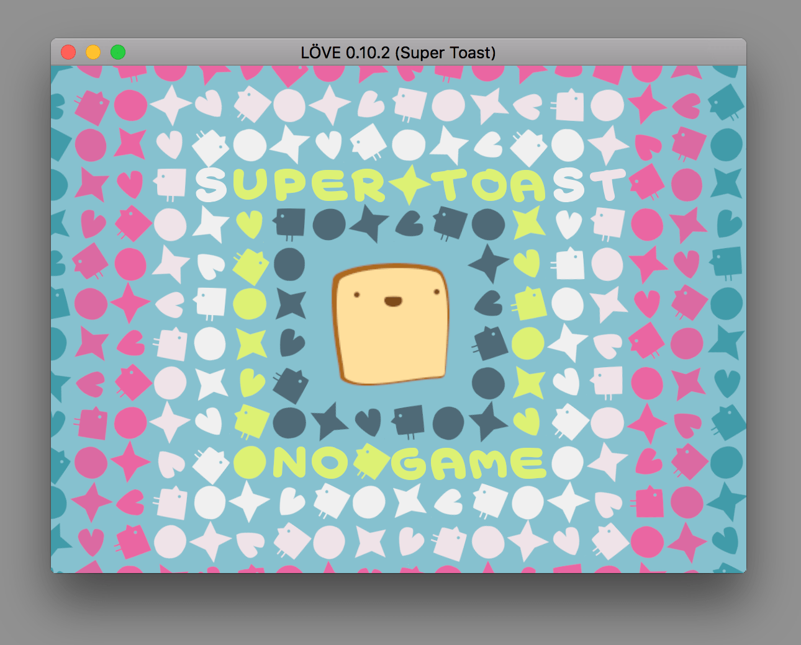

## Beginner friendly LÖVE 2D documentation
Welcome to the beginner friendly love2d documentation. Here you'll find a group of examples and neat implementation of this beautiful game framework. Follow me on this exciting journey to becoming a game developer, put on your seatbelt and enjoy the ride. (Seriously, please put on that seatbelt the road is a little rough).

### What is LÖVE?
LÖVE is an *awesome* framework you can use to make 2D games in Lua. It's free, open-source, and works on Windows, Mac OS X, Linux, Android, and iOS. Source: <a href="https://love2d.org" target="_blank">love2d.org</a>

> If you really want to know more details about this *wonderful framework* and what is Lua, for example, go to "[Is LÖVE good for me?](site/is-love-good-for-me)"

### Getting started
Let us begin with the basic requirements.

1. The **<a href="https://love2d.org/#download" target="_blank">love2d application</a>**.
2. Any **text editor** of choice. However, my recomendations are:
    - <a href="http://www.sublimetext.com/" target="_blank">Sublime Text</a> (Freemium. macOS/Windows/Linux Support).
    - <a href="https://atom.io/" target="_blank">Atom</a> (Free. Open Source. macOS/Windows/Linux Support).
    - <a href="https://code.visualstudio.com/" target="_blank">Visual Studio Code</a> (Free. Open Source. macOS/Windows/Linux Support).
    - <a href="https://studio.zerobrane.com/" target="_blank">ZeroBraneStudio</a> (Not really a text editor, it's an IDE. Free. Portable. Open Source. macOS/Windows/Linux Support).

    I'll be using **Visual Studio Code** in this guide because it would be visually easier to setup, but no matter which text editor you choose the code should run the same on any platform. Choosing a text editor is like choosing the flavor of an ice cream, at the end of the day it's a matter of preference. I'll recommend you try all of these and then choose the one that you *feel more comfortable* using, you'll be working with it on many projects from now on.

3. **Stay Organized**: This is not really a requirement but more like a recommendation, allocate a folder on your Documents or Desktop to create an accessible place to work with your files. A folder named `/love2d-projects` should work just fine.

---
#### Installing LÖVE
Download **love2d** to your desktop from <a href="https://love2d.org/#download" target="_blank">the download site</a>.

Choose the appropriate file for your current operating system. I'll go through the process of using both Windows and MacOS versions on this quick <a href="#installation-process" target="_blank">installation process</a>.

*At the moment of this writing, the current stable version of LÖVE is 0.10.2. if the current version is higher than the one found in this guide, and you want to follow along with the same process please go to 'other versions' in the download site and choose the same version described in here. But, if you have a higher version of the application there should be no problems.*

#### Installation Process
Once the love2d file is downloaded, installing the application is as easy as uncompressing the file and opening the application.

The application should look like the following:

##### Windows Installation
Open the installer. Click on Next. Click on I agree. Now you can decide where you install LÖVE. It doesn't matter where you install LÖVE but make sure to remember the folder. This folder will be referred to as the Installation Folder.

The recommended folder is C:/Program Files/LOVE.

Click on Next. Click on Install.

When LÖVE is done installing, click Finish.

##### MacOS Installation
Go to the applications folder. Drag the Love.app to the Applications folder.

Open the love.app at least once.

#### Make your first game